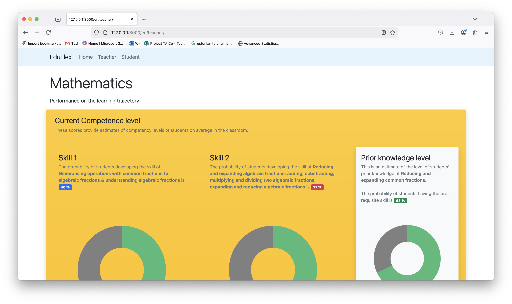

# Student Interaction Data Analysis with Bayesian Inference
<div style="display: flex; justify-content: space-between;">
  <div style="text-align: center;">
    
    <p><em>Figure 1: Teacher dashboard showing class mastery levels</em></p>
  </div>
  <div style="text-align: center;">
    
    <p><em>Figure 2: Student dashboard with personalized progress</em></p>
  </div>
</div>

##  Project Description

This Django project analyzes students' interaction data stored in xAPI statements from the Vara learning platform. The dataset captures various key learning features including:

* Number of attempts per activity
* Hint usage patterns
* Score achievement
* Time spent on activities

The system also incorporates a mapping of each learning activity to specific mathematics skills aligned with a 9th Standard Algebra curriculum.

The analysis pipeline:
* Preprocesses the raw xAPI statement data
* Performs Bayesian inference using Expectation-Maximization (EM) techniques
* Estimates probabilities for mastering different mathematics skills for each student (e.g., fraction operations, algebraic simplification)
* Builds dashboard using learnder model to visualize student's current mastery levels of skills

The resulting insights help educators understand skill mastery at both individual and group levels, enabling targeted instructional interventions.

## 🛠️ Installation
Install the dependencies using the following command
```sh
pip install -r requirements.txt
```

### Setup
1. Clone the repository:
   ```sh
   git clone https://github.com/pankajchejara23/eduflex-prototype
   cd eduflex-prototype

2. Create and activate virtual environment (recommended):
    ```sh
    python -m venv venv
    source venv/bin/activate  # Linux/Mac
    ```
3. Install dependencies:
    ```sh
    pip install -r requirements.txt
    ```
## 🚀 Usage

Run the following command to start the server
```sh
pip install -r requirements.txt
```

